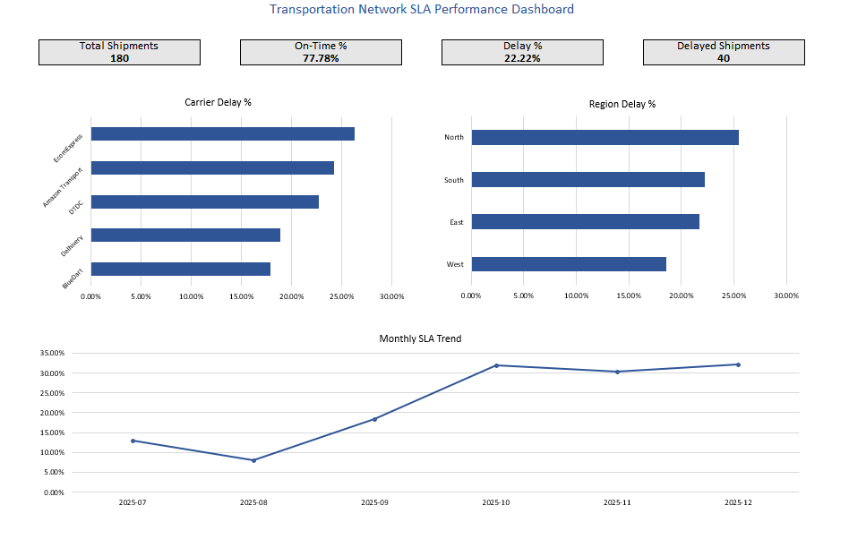

🚚 Transportation Network SLA Performance Analysis
📌 Project Overview

This project simulates a transportation network database and analyzes delivery performance using SQL.

The objective is to measure Service Level Agreement (SLA) performance, identify delay drivers, and evaluate operational efficiency across carriers, regions, and time.

This project demonstrates:

Relational database design

Data modeling with foreign keys

KPI calculation using SQL

Business-focused analytics queries

Performance trend analysis

🏗 Database Design

The database consists of four core tables:

1️⃣ cities

Stores origin and destination city information.

2️⃣ carriers

Stores transportation carrier details including cost per km.

3️⃣ delay_reasons

Stores standardized delay codes and categories (Internal / External).

4️⃣ shipments

Core fact table containing shipment records including:

Origin & destination

Carrier

Ship date

Expected delivery date

Actual delivery date

Delay code

Status (On Time / Delayed / In Transit)

All relationships are enforced using foreign key constraints.

📊 Business KPIs Implemented
1️⃣ Overall On-Time Delivery Performance

File: 03_kpi_on_time_analysis.sql

Total shipments

On-time shipments

SLA percentage

2️⃣ Carrier Delay Performance

File: 04_carrier_delay_performance.sql

Carrier-wise total shipments

Delayed shipments

Delay percentage

Helps identify underperforming carriers.

3️⃣ Region-Level SLA Performance

File: 05_region_delay_performance.sql

Destination region

Delay percentage

Identifies high-risk operational regions.

4️⃣ Delay Reason Analysis

File: 06_delay_reason_analysis.sql

Frequency of each delay reason

Highlights operational bottlenecks.

5️⃣ Monthly SLA Trend

File: 07_monthly_sla_trend.sql

Monthly shipment volume

Delay percentage trend

Supports performance tracking over time.

🧠 Business Logic

On Time → actual_delivery_date ≤ expected_delivery_date

Delayed → actual_delivery_date > expected_delivery_date

In Transit → actual_delivery_date IS NULL

SLA calculations exclude In Transit shipments.

🛠 Technologies Used

MySQL

SQL (JOIN, GROUP BY, conditional aggregation)

Date-based time analysis

KPI modeling

📁 Project Structure
01_database_setup.sql
02_data_insert.sql
03_kpi_on_time_analysis.sql
04_carrier_delay_performance.sql
05_region_delay_performance.sql
06_delay_reason_analysis.sql
07_monthly_sla_trend.sql

🎯 Key Skills Demonstrated

Relational database schema design

Data normalization

KPI development

Operational analytics

Business-oriented SQL querying

Performance monitoring logic

🚀 Conclusion

This project simulates a transportation network performance monitoring system and demonstrates how SQL can be used to transform raw shipment data into actionable operational insights.

🎯 Optional Upgrade (Makes It Look Even Better)

At the top, add:

Author: Shahid Mohammed
Role Focus: Transportation Operations / Network Performance Analysis

This makes it recruiter-friendly.
